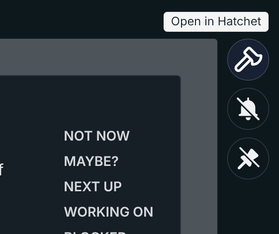
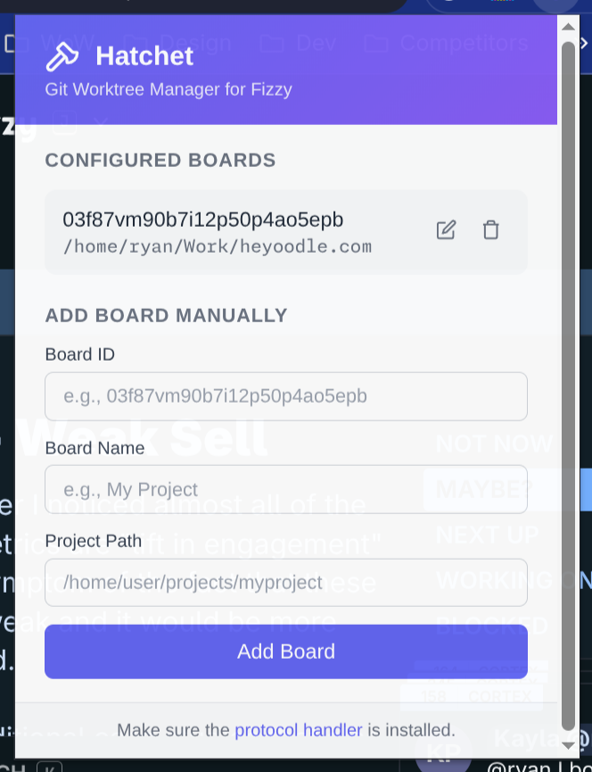

# Hatchet

A TUI for managing work via Fizzy and Git worktrees with automatic database cloning for Rails projects.


## Installation

### Arch Linux (AUR)

```bash
yay -S hatchet
```

### From Source

Requires [Bun](https://bun.sh).

```bash
git clone https://github.com/ryanrhughes/hatchet.git
cd hatchet
bun install
bun hatchet
```

### Shell Alias

Add an `ht` alias for quick access:

#### Bash

Add to `~/.bashrc`:

```bash
alias ht="hatchet"
```

#### Zsh

Add to `~/.zshrc`:

```bash
alias ht="hatchet"
```

#### Fish

Create `~/.config/fish/conf.d/hatchet.fish`:

```fish
alias ht="hatchet"
```

#### From Source

If running from source, point the alias to bun:

```bash
# Bash/Zsh
alias ht="bun ~/path/to/hatchet/src/main.ts"

# Fish (~/.config/fish/conf.d/hatchet.fish)
alias ht="bun ~/path/to/hatchet/src/main.ts"
```

## Features

- Create, switch, and remove Git worktrees
- Launch multiple tools (Opencode, NeoVim, Terminal) in your worktree
- Automatic SQLite database cloning for Rails projects
- Copies environment files (`.env.local`, `config/master.key`, etc.)
- Fizzy integration for task management (via [fizzy-cli](https://github.com/robzolkos/fizzy-cli))

## Keybinds

From the main screen, use these shortcuts to quickly launch tools in the selected worktree's folder:

| Key | Action |
|-----|--------|
| `c` | Open OpenCode |
| `t` | Open shell here |
| `n` | Open NeoVim |
| `Shift + c` | Open OpenCode in a new terminal |
| `Shift + t` | Open new terminal window |
| `Shift + n` | Open NeoVim in a new window |

**Tip:** Combine shortcuts for a multi-tool workflow. For example, `Shift + n` followed by `c` opens NeoVim in a new window and OpenCode in the current terminal, giving you both in the same context.

### Deleting Worktrees


## Fizzy Integration

Hatchet integrates with [Fizzy](https://fizzy.do) for task management. To use Fizzy features, install [fizzy-cli](https://github.com/robzolkos/fizzy-cli) and run `fizzy setup`.

Once configured, Hatchet can:
- Display your Fizzy boards and cards
- Create worktrees directly from Fizzy cards
- Change worktrees for easy context switching
- Seed Opencode sessions with Fizzy card details

**Tip:** Set your `board` in your project's `.fizzy.yaml` to skip board selection.

### Create Worktrees from Fizzy Cards
With `fizzy-cli`, you're able to create worktrees directly from cards in Fizzy without leaving Hatchet.


### Load Context from Fizzy

When a worktree is created from Fizzy, you'll be given the option to include the contents of the card when launching OpenCode to assist in getting you started even faster!


## Browser Extension

The Hatchet Chrome extension adds an "Open in Hatchet" button to Fizzy, allowing you to create or switch to a worktree directly from your browser.



### Installation

1. Install the protocol handler:
   ```bash
   hatchet --install-handler
   ```

2. Install the Chrome extension:
   - Open `chrome://extensions`
   - Enable **Developer mode**
   - Click **Load unpacked**
   - Select `/usr/share/hatchet/chrome-extension` (or `chrome-extension/` if running from source)

### Configuration

The first time you click the Hatchet button on a board, you'll be prompted to enter the project path. This maps the Fizzy board to your local git repository.

You can also manage board-to-path mappings in the extension popup:



### How It Works

1. Click the Hatchet button on any Fizzy card
2. A terminal opens and creates/switches to a worktree for that card
3. OpenCode launches with the card context pre-loaded
4. When you exit, you're dropped into a bash shell in the worktree

## Rails Database Cloning

When creating a worktree in a Rails project with SQLite, Hatchet automatically:

1. Parses `config/database.yml` directly (no Rails environment needed)
2. Finds all SQLite database files including:
   - Standard databases (`db/development.sqlite3`, `storage/*.sqlite3`)
   - Multi-tenant databases with `%{tenant}` patterns
   - WAL and SHM files for consistency
3. Copies everything to the new worktree

### Supported database.yml Patterns

```yaml
# Single database (older Rails)
development:
  adapter: sqlite3
  database: db/development.sqlite3

# Multi-database (Rails 6+)
development:
  primary:
    <<: *default
    database: storage/development.sqlite3
  cache:
    <<: *default
    database: storage/cache.sqlite3

# Multi-tenant (acts_as_tenant style)
development:
  primary:
    <<: *default
    database: storage/tenants/development/%{tenant}/main.sqlite3
    tenanted: true
```

### Files Copied Automatically

These files are copied from the main repo to the worktree if they exist:

- `.env.local`
- `.env.development.local`
- `config/master.key`
- `config/credentials/development.key`

## Running Multiple Worktrees

### Port Assignment

Each worktree needs its own port. Add this `bin/dev` script to your Rails project for automatic port assignment:

```ruby
#!/usr/bin/env ruby
require 'socket'

def find_free_port(start_port = 3000)
  port = start_port
  loop do
    begin
      TCPServer.new('127.0.0.1', port).close
      return port
    rescue Errno::EADDRINUSE
      port += 1
    end
  end
end

port = find_free_port
puts "Starting on port #{port}..."
exec "./bin/rails", "server", "-p", port.to_s, *ARGV
```

Each worktree automatically gets the next available port (3000, 3001, 3002, etc.).

### Session Isolation

When running multiple worktrees on different ports, they share the same session cookie (same localhost domain). Logging into one worktree logs you out of another.

**Solution**: Use separate browser profiles or private/incognito windows for each worktree.

## Configuration

Hatchet supports configuration via JSONC files (JSON with comments). Config is loaded from:

1. `.hatchet.jsonc` in the project folder (repo root) - project-specific
2. `~/.config/hatchet/config.jsonc` - global config

Project config takes precedence over global config.

### Available Options

```jsonc
{
  // Skip copying SQLite databases when creating worktrees
  "skipDatabaseCopy": false,
  // Skip copying environment files (.env.local, master.key, etc.)
  "skipEnvCopy": false,
  // Default model to launch with Opencode
  "opencodeModel": "opencode/gpt-5.1-codex"
}
```
